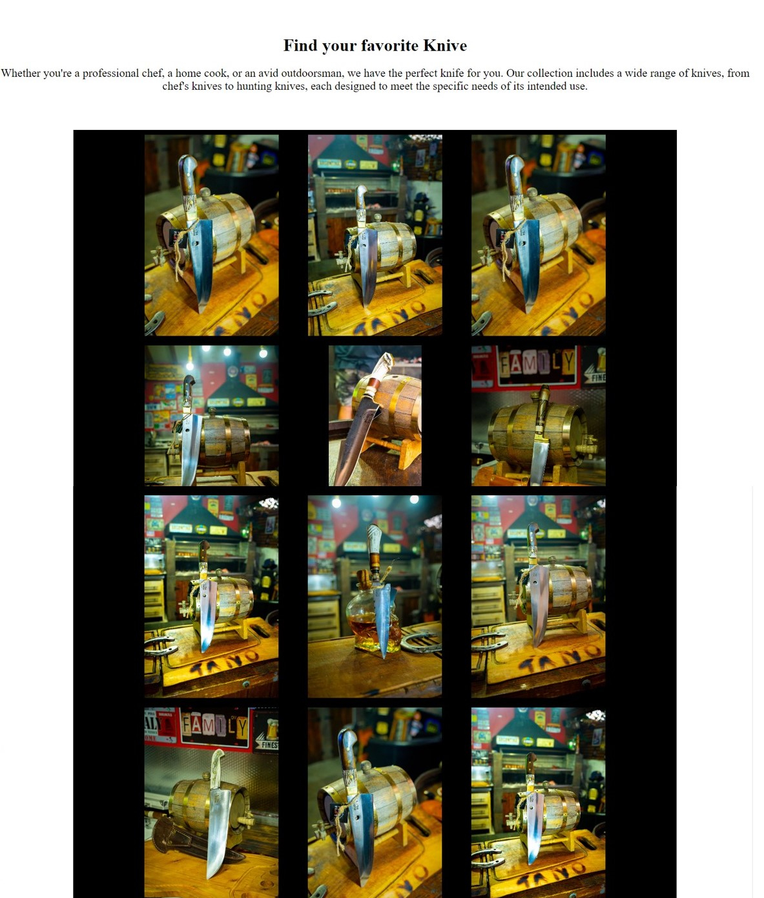

# *Puro Filo*

The Puro Filo website allows people to see about the company "Puro Filo" and find information about the craft knives. The visitors of the website could quickly contact the company about the knives and the prices of them.

The site can be accessed by this [link](https://nicomorgado.github.io/D-Frenzzo/)

---
## User Stories

### First Time Visitor Goals:

* As a First Time Visitor, I want to easily understand the main purpose of the site, so I can learn more about the start-up.
* As a First Time Visitor, I want to be able to easily navigate through the website, so I can find the content.
* As a First Time Visitor, I want to see the details of the knivs.

### Returning VisitorGoals:

* As a Returning Visitor, I want to see various knives, so that I can choose from.
* As a Returning Visitor, I want to see information about the knives, so that I can learn about them and make a informed decision.
* As a Returning Visitor, I want to find a way to get in contact with the Start-up, so that I can ask additional questions or send a request about a particular knive.

### Frequent Visitor Goals:
* As a Frequent User, I want to check whether there are any new knives, so I can get a new knive.

## Features

+ ### Navbar

+ ##### Navigation
    - Positioned at the top of the page.
    - Contains logo of the company on the middle-top that links you to the home page.
    - Contains navigation links on the middle:
        * Home - leads to the home page where users can learn about the company and the knivs.
        * Craft Knives - leads to the gallery page where users can see available animals in the Animal Shelter.
        * Contact - leads to the contact form page where users can fill out the form in order to get in touch with the company.
    - The links have animated hover effect.
    - The navigation is clear and easy to understand for the user.
    
    - The navigation bar is responsive

---

+ ### Home Page

    - Represent: 

        * the main idea of the company.
        * Sharring the history of the Start-up.
        * Shows the discraption of the knives.

    

---

+ #### First section

    - Is divided into two.
        * A video that plays automatically, but its volume is muted.
        * And the "about us" of the Start-up.

    

--- 

+ #### Highlights Section

    - Highlight Section has 3 images with descriptive details of the knives.
    - Tells website visitors how the knives are made of.
    - Attracts viewers to buy the knives.

    
    

---
+ #### Footer

    - Footer contains:
        - social media link that open in a new tab.
        - contact link that bring you to the contact page.

​
    
​
---
+ ### Craft Knives Page

    - Craft Knives page has a introduction message for the visitors that contains an incentive to buy a knive.

    - It has the photos with Hover right after the introduction message.

    - Hover of the photos:

        - Shows the code of the Knive.
        - Link to the contact page.

    - It has a footer identical to the home page's footer.
    
​
    

---
+ ### Contact page

    - Contact page has a contact form:

        - All text input fields are customized.
        - Labels are animated on hover.
        - All inputs are set to be required to fill out.
        - The submit button is animated on hover.

    - The page is responsive on all common screen sizes.

    - The submit button leads to the response page.
​
    

---
+ ### Response page

    - Response page appears after submitting the contact form.
    - It contains the thank you message and the checking the stock to send the details.
    - It will automatically direct the user to the main page in 8 seconds.

    

---
## Technologies Used

- [HTML](https://developer.mozilla.org/en-US/docs/Web/HTML) was used as the foundation of the site.
- [CSS](https://developer.mozilla.org/en-US/docs/Web/css) - was used to add the styles and layout of the site.
- [CSS Flexbox](https://developer.mozilla.org/en-US/docs/Learn/CSS/CSS_layout/Flexbox) - was used to arrange items simmetrically on the pages and making the website screem friendly.
- [CSS roots](https://developer.mozilla.org/en-US/docs/Web/CSS/:root) was used to declaring global CSS variables and apply them throughout the project. 
- [VSCode](https://code.visualstudio.com/) was used as the main tool to write and edit code.
- [Git](https://git-scm.com/) was used for the version control of the website.
- [GitHub](https://github.com/) was used to host the code of the website.

---
## Design

### Color Scheme

- Black color was used as the main color of the website.

- White Color was used as a background color.

- Red color was used for the logo and mach things with it.

---

### Manual testing

| feature | action | expected result | tested | passed | comments |
| --- | --- | --- | --- | --- | --- |
| Navbar | | | | | |
| Home | Click on the "Home" link | The user is redirected to the main page | Yes | Yes | - |
| Knives available | Click on the "Craft Knives" link | The user is redirected to the Knives available page | Yes | Yes | - |
| Contact | Click on the "Contact" link | The user is redirected to the contact page | Yes | Yes | - |
| Footer | | | | | |
| Instagram icon in the footer | Click on the Instagram icon | The user is redirected to the Instagram page | Yes | Yes | - |
| "Contact Us" button | Click on the "Embolo" button | The user is redirected to the contact page | Yes | Yes | - |
| Home page | | | | | |
| Images in the home page | User hover the image | Description of the knives appear on the image | Yes | Yes | - |
| craft knives page | | | | | |
| Images in the craft knives | User hover the image | code of the knives and "ask for it" buttom appear on the image | Yes | Yes | - |
| "Ask for it" button in Hero section | Click on the "ask for it" button | The user is redirected to the contact page | Yes | Yes | - |
| Contact page | | | | | |
| First name input | Enter the first name | The first name is entered | Yes | Yes | If user doesn't enter the first name, the error message appears |
| Last name input | Enter the last name | The last name is entered | Yes | Yes | If user doesn't enter the last name, the error message appears |
| Email input | Enter the email | The email is entered | Yes | Yes | If user doesn't enter the email, the error message appears. If user enters not valid email, the error message appears |
| Address input | Enter the full address | The address is entered | Yes | Yes | If user doesn't enter the address, the error message appears |
| knive code input | Enter the code of the knive | The code is entered | Yes | Yes | If user doesn't enter the code, the error message appears |
| "Submit" button | Click on the "let's cut it" button | The user is redirected to the response page | Yes | Yes | - |
| Response page | | | | | |
| Response message | The user will be automatically redirected to the home page after 8 seconds | The user is redirected to the home page | Yes | Yes | - |

---
​
### Bugs
+ ##### Solved bugs
    1. The Craft Knives page had a problems with the diferent tipe of screem. 
    
        *Solutions:* flexbox was used.
    
    1. The video was having problems on smalls screems.
        
        *Solution:* aspect-ratio was used. 

    ---
+ ##### Unsolved bugs
    - None.
+ ##### Mistakes
    - Mistakes were made while committing changes. I used the sames commits messege.
    - While progressing in my code I learned to use commits.

---
## Validator testing
+ ### HTML
  #### Home Page
    - No errors or warnings were found when passing through the official W3C validator.

    
    
  #### Gallery Page
    - No errors or warnings were found when passing through the official W3C validator.

    

  #### Contact Page
    - No errors or warnings were found when passing through the official W3C validator.

    

  #### Response Page
    - No errors or warnings were found when passing through the official W3C validator.

    
    
+ ### CSS
  No errors or warnings were found when passing through the official W3C (Jigsaw) validator:
    
  
  

+ ### Accessibility and performance 
    - Using lighthouse in devtools I confirmed that the website is performing well, accessible and colors and fonts chosen are readable.
    
  #### Home page

  

  #### Gallery page

  

  #### Contact page

  

  #### Response page

  

---
## Deployment

- The site was deployed to GitHub pages. The steps to deploy are as follows: 
  - In the [GitHub repository](https://github.com/nicomorgado/D-Frenzzo), navigate to the Settings tab 
  - From the source section drop-down menu, select the **Main** Branch, then click "Save".
  - The page will be automatically refreshed with a detailed ribbon display to indicate the successful deployment.

The live link can be found [here](https://nicomorgado.github.io/D-Frenzzo/)

## Local Deployment

In order to make a local copy of this project, you can clone it.
In your IDE Terminal, type the following command to clone my repository:

- `git clone https://github.com/nicomorgado/D-Frenzzo`

---

## Future improvements
- add custom 404 page.
- improve the quality of the commit messages (I am aware that some of them are not very clear and not meeting the standards and will improve them in the future).
- add fully functional contact form.

---
## Credits

+ #### Content

    - Inspiration for the README.md came from [Iuliia Konovalova](https://github.com/IuliiaKonovalova) Using her README.md as my skeleton.

+ #### Media

    - All the images for the website were given by the owner of Puro Filo, and where taken by Martin Howard Gutierrez.
+ #### Tools

    - [cooler](https://coolors.co/) was used to create the color palette.

---

## Acknowledgments

- [Iuliia Konovalova](https://github.com/IuliiaKonovalova) Iuliia Konovalova guided me through the development of the project and helped me to learn a lot of new things by challenging me to do something new like using Flexbox.
- [Code Institute](https://codeinstitute.net/) tutors and Slack community members for their support and help.

---